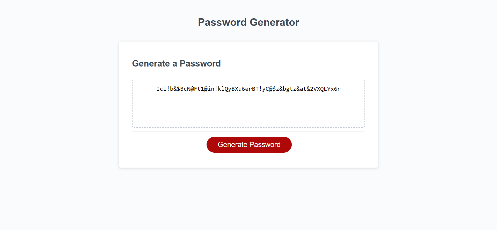

# Password-Generator

## Outline
For this project I used Javascript to build a password generator.

## The goal
Build a password generator that has a fixed number of characters between 8 and 128 no more, no less. It Prompts the user to include or exclude  uppercase, lowercase, numbers, and or special characters to be used in the generated password. 

## The solution
I acheived this by storing strings in varibles that were split to be choosen indiviually with the "concat" method. Too prompt the user for input i used "if" statements that contain booleans and operators to compare them to one another. I also used a "for loop" with the "math.floor" and "math.random" methods to drill into the no longer empty array. In turn this will grab a random character from the split "strings" and put them into another string which results in a randomly generatord password.

## Preview
Have a look.

GitHub Pages: 
GitHub Repository: 

